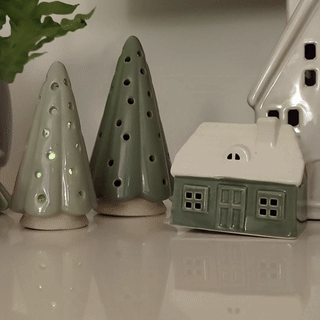

# An Arduino christmas decoration LED schema

The schemas for the three different lights are defined by a function of the light and the time for the period.

Wiring the LED to the analog output creates the light effects.

## Real world implementation example (3x the normal speed)

